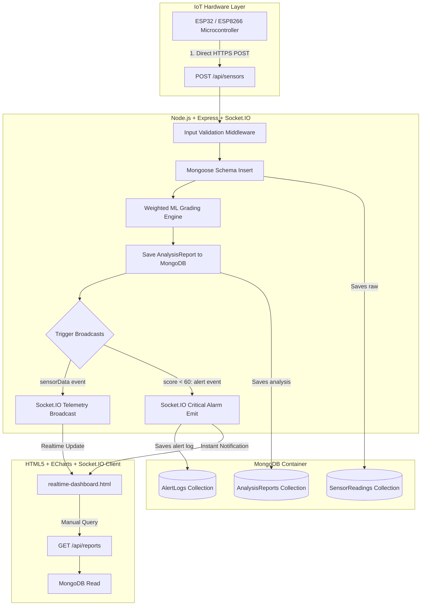

# 🥛 MilkoSense - Production-Grade Architecture Migration Guide

This guide describes the complete migration of the MilkoSense smart milk testing system from a Firebase-dependent prototype to a highly scalable, production-ready, Dockerized full-stack architecture leveraging **Express.js**, **Socket.IO**, and **MongoDB**.

---

## 🏛️ System Architecture Diagram



---

## 📂 Production-Grade Folder Structure

```
MilkoSense/
│
├── frontend/                     # Pure static HTML, CSS & client logic (Independent)
│   ├── public/                   # Client-facing static HTML files
│   ├── assets/                   # Static page resources (css, js, images)
│   ├── services/                 # Centralized state/logic services
│   │   ├── api.js                # Abstracts HTTP requests to REST APIs (loading/error stats)
│   │   └── socket.js             # Handles Socket.IO client connections & reconnect tracking
│   ├── package.json              # Independent client launcher config
│   └── Dockerfile                # Frontend image build instructions
│
├── backend/                      # Node.js + Express.js APIs & Websockets (Independent)
│   ├── src/                      # Source scripts
│   │   ├── config/               # Database and system configs (db.js)
│   │   ├── controllers/          # Route handlers (sensorsController, reportsController, etc.)
│   │   ├── middleware/           # System checks (logger, errorHandler, validator)
│   │   ├── models/               # Mongoose Schemas (SensorReading, AnalysisReport, AlertLog)
│   │   ├── routes/               # Express routing registrations
│   │   ├── services/             # Backend operations (aiService.js)
│   │   ├── sockets/              # Modular Socket.IO setup (index.js)
│   │   └── server.js             # Express core runtime entrypoint
│   ├── package.json              # Node dependencies configuration
│   ├── .env                      # Ports & MongoDB connection credentials
│   └── Dockerfile                # Backend image build instructions
│
├── docs/                         # Consolidated product documentation
│   └── MIGRATION_GUIDE.md        # Technical architectural manual (This file)
│
├── docker-compose.yml            # Multi-container cluster orchestrator (App + DB)
└── README.md                     # Root documentation manual
```

---

## 💾 Database Design (MongoDB Mongoose Schemas)

We have created three relational-style collections with automatic indexing:

### 1. `SensorReading` (Raw Telemetry)
Stores raw high-frequency physical values directly posted from sensors.
```javascript
const sensorReadingSchema = new mongoose.Schema({
    ph: { type: Number, required: true, min: 0, max: 14 },
    temperature: { type: Number, required: true },
    tds: { type: Number, required: true },
    turbidity: { type: Number, required: true },
    gas: { type: Number, required: true },
    cattleType: { type: String, default: 'cow' },
    season: { type: String, default: 'summer' },
    timestamp: { type: Date, default: Date.now, index: true }
});
```

### 2. `AnalysisReport` (Graded Reports)
Stores detailed AI quality gradings and references the raw sensor readings.
```javascript
const analysisReportSchema = new mongoose.Schema({
    sensorReading: { type: mongoose.Schema.Types.ObjectId, ref: 'SensorReading', required: true, unique: true },
    score: { type: Number, required: true, index: true },
    qualityGrade: {
        grade: { type: String, required: true },
        label: { type: String, required: true },
        color: { type: String, required: true },
        confidence: { type: Number, required: true }
    },
    adulterationRisk: {
        detected: { type: Boolean, default: false },
        riskLevel: { type: String, default: 'low' },
        risks: [{ type: String, severity: String, message: String }]
    },
    spoilagePrediction: {
        hours: { type: Number, required: true },
        riskLevel: { type: String, required: true },
        recommendation: { type: String, required: true }
    },
    recommendations: [{ category: String, priority: String, action: String, steps: [String] }],
    insights: [{ message: String }],
    timestamp: { type: Date, default: Date.now, index: true }
});
```

### 3. `AlertLog` (Safety Alarm History)
Persists substandard readings (<60 quality score) for administrative audit trails.
```javascript
const alertLogSchema = new mongoose.Schema({
    title: { type: String, required: true },
    score: { type: Number, required: true },
    message: { type: String, required: true },
    severity: { type: String, enum: ['low', 'medium', 'high', 'critical'], default: 'medium' },
    adulteration: { type: Boolean, default: false },
    resolved: { type: Boolean, default: false, index: true },
    timestamp: { type: Date, default: Date.now, index: true }
});
```

---

## 📡 REST Endpoints & Socket.IO Events

### REST API Contracts
*   **`POST /api/sensors`**: Ingests new telemetry, runs AI analytics, saves the report, emits Socket.IO updates, and returns a compiled response.
*   **`GET /api/sensors`**: Returns the latest reading recorded.
*   **`POST /api/analysis`**: Generates AI milk scores on demand.
*   **`GET /api/reports`**: Fetches the last 100 historical records populated with raw parameters.
*   **`GET /api/realtime`**: Dynamically compiles dashboard counters directly from MongoDB.

### Realtime WebSocket (Socket.IO) Events
*   **`sensorData` (Server -> Client)**: Broadcasts newly ingested sensor values and grades instantly.
*   **`alert` (Server -> Client)**: Dispatches a priority alarm payload when scores drop below 60.

---

## 🔌 ESP32 Sensor Hardware Integration Example

Flash the following code to your **ESP32** microcontroller to post live sensor readings directly to your new backend server.

```cpp
#include <WiFi.h>
#include <HTTPClient.h>
#include <ArduinoJson.h> // Make sure to install ArduinoJson via Library Manager

// WiFi Credentials
const char* ssid = "YOUR_WIFI_SSID";
const char* password = "YOUR_WIFI_PASSWORD";

// Server API Endpoint
// In local development, use your PC's local IP (e.g. 192.168.1.50)
const char* serverUrl = "http://192.168.1.50:5000/api/sensors";

// Pin mappings for physical sensors
const int PH_PIN = 34;
const int TEMP_PIN = 35;
const int TDS_PIN = 32;
const int TURBIDITY_PIN = 33;
const int GAS_PIN = 39;

void setup() {
  Serial.begin(115200);
  
  // Connect to Wi-Fi network
  WiFi.begin(ssid, password);
  Serial.print("Connecting to Wi-Fi");
  while (WiFi.status() != WL_CONNECTED) {
    delay(500);
    Serial.print(".");
  }
  Serial.println("\nWiFi Connected!");
  Serial.print("IP Address: ");
  Serial.println(WiFi.localIP());
}

void loop() {
  if (WiFi.status() == WL_CONNECTED) {
    // 1. Read values from physical analog/digital pins
    float rawPh = analogRead(PH_PIN) * (14.0 / 4095.0); // Map to 0-14 pH range
    float rawTemp = (analogRead(TEMP_PIN) * (3.3 / 4095.0)) * 100.0; // Voltage to temperature
    float rawTds = analogRead(TDS_PIN) * (2000.0 / 4095.0); // Map to ppm
    float rawTurbidity = analogRead(TURBIDITY_PIN) * (50.0 / 4095.0); // Map to NTU
    int rawGas = analogRead(GAS_PIN); // Gas sensor units

    // 2. Prepare JSON data payload
    StaticJsonDocument<200> doc;
    doc["ph"] = rawPh;
    doc["temperature"] = rawTemp;
    doc["tds"] = rawTds;
    doc["turbidity"] = rawTurbidity;
    doc["gas"] = rawGas;
    doc["cattleType"] = "cow"; // Select Jersey, Holstein, etc.
    doc["season"] = "summer";

    String jsonString;
    serializeJson(doc, jsonString);

    // 3. Dispatch HTTP POST request to MilkoSense server
    HTTPClient http;
    http.begin(serverUrl);
    http.addHeader("Content-Type", "application/json");
    
    Serial.println("Sending data: " + jsonString);
    int httpResponseCode = http.POST(jsonString);
    
    if (httpResponseCode > 0) {
      String response = http.getString();
      Serial.print("HTTP Success: ");
      Serial.println(httpResponseCode);
      Serial.println(response);
    } else {
      Serial.print("HTTP Error occurred: ");
      Serial.println(httpResponseCode);
    }
    
    http.end();
  } else {
    Serial.println("WiFi Disconnected. Reconnecting...");
    WiFi.begin(ssid, password);
  }

  // Poll sensor data every 3 seconds
  delay(3000);
}
```

---

## 🛠️ Step-by-Step Architecture Migration Roadmap

To transition your development workflow seamlessly:

1.  **Remove Old Files**: Run `docker-compose down` if you are running the older containers.
2.  **Environment Variables**: Create or update your `backend/.env` with your `MONGO_URI`.
3.  **Boot Multi-Container Stack**: In your project root folder, execute:
    ```bash
    docker-compose up --build
    ```
    This commands:
    *   Fires up a sandboxed **MongoDB container** mapping database state to the host's `mongo_data` volume.
    *   Boots the **Express + Socket.IO backend** on port 5000, establishing the Mongoose connection database client.
    *   Spins up the **frontend server** on port 3000.
4.  **Hardware Ingestion**: Configure your physical ESP32 module with the PC local network IP and watch the parameters stream into the MongoDB database while updating ECharts graphs instantly via WebSockets!
